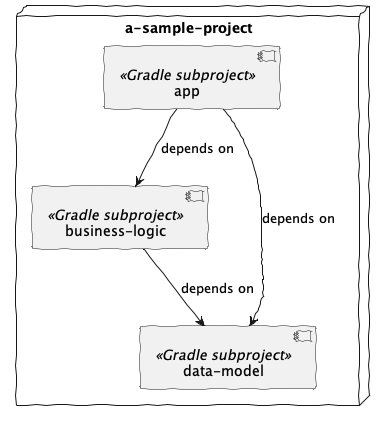

# Gradle Playground

This repository started out as place for the code I was creating while following along
the [Udemy course: Modern Gradle Fundamentals](https://www.udemy.com/course/modern-gradle-fundamentals) by Jendrik
Johannes.

By now, it is my playground to try out all sorts of [Gradle](https://gradle.org/) things before (maybe) applying them
to 'real' projects.

## System architecture

The sample project is a quite simple Gradle multi-project named very creatively 'a-sample-project', consisting of 3
Gradle
subprojects:

* app
* business-logic
* data-model

The dependency-relationship among them is the following:

